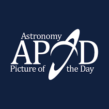
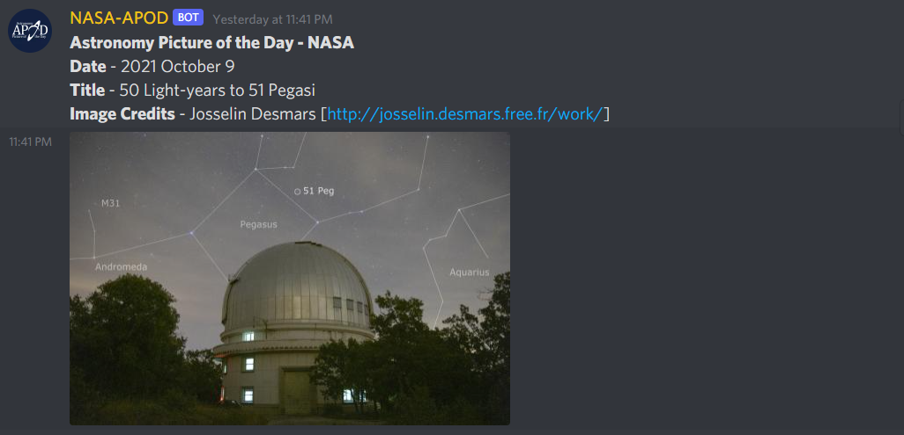

# NASA APOD Discord Bot 

Fetches information from NASA APOD [site](https://apod.nasa.gov/apod/).

## Demo Look



## Contributing

Before creating an issue, please ensure that it hasn't already been reported/suggested. If you wish to contribute to the codebase, feel free to fork the repository and submit a pull request! install the dependencies using

```
pip install -r requirements.txt
```

## License

NASA-APOD is licensed under the GPL 3.0 license. See the file LICENSE for more information. If you plan to use any part of this source code in your own bot, I would be grateful if you would include some form of credit somewhere.
